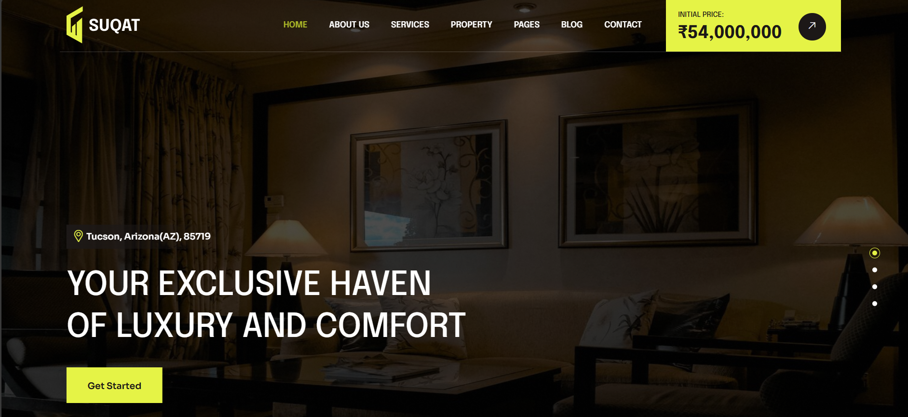

---

# 🏡 Suqat - State-of-the-Art Facilities for Luxurious Living  

## 🌟 About Suqat  
Awebpage (frontend) of Suqat- With over **25 years of expertise**, Suqat is dedicated to helping investors build their dream properties while achieving business success with **perfection**.  

We specialize in crafting **exceptional spaces** that seamlessly blend **modern design** with **functionality**. Our properties are designed with:  

✅ **Innovative Architecture**  
✅ **Premium Amenities**  
✅ **Unmatched Comfort & Elegance**  

At Suqat, we **redefine luxurious living**, ensuring a **superior lifestyle experience** for our clients.  

---

## 🚀 Features  

🔹 **Modern & Aesthetic Designs** – Architectural excellence that stands out.  
🔹 **Smart Living Solutions** – Advanced home automation for convenience.  
🔹 **Sustainable & Eco-Friendly** – Energy-efficient and green building practices.  
🔹 **Premium Amenities** – High-end facilities for a truly lavish experience.  

---

## 📸 Preview  
  

---

## 🛠️ Technologies Used  

- **HTML5, CSS3, JavaScript** – For a seamless and responsive UI.  
- **React.js** – Ensuring high performance and scalability.  
- **Node.js** – Powering backend functionalities.  

---

## 🌐 Live Demo  
🔗 [Visit Suqat Live](https://real-estate-eight-eta.vercel.app/)  

---

## 🤝 Contributing  

We welcome contributions! If you'd like to contribute, please:  
1. **Fork the repository**  
2. **Create a feature branch**  
3. **Submit a pull request**  

---

## 📩 Contact  (in case you want the template)

📧 **Email:** ronitpathak12345@gmail.com
